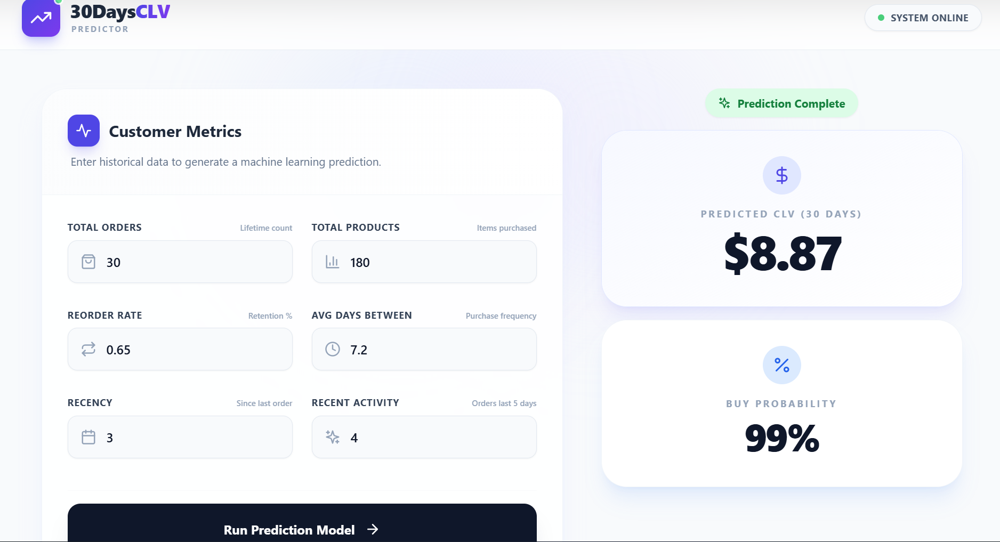

# 🚀 30-Day CLV Predictor

### 🔮 Predict Short-Term Customer Lifetime Value Using Machine Learning

🌐 **Live App (Vercel)**
👉 **[https://30-day-clv-predictor.vercel.app/](https://30-day-clv-predictor.vercel.app/)**

---

## 🎥 Demo

<p align="center">
  
</p>

---

## 🧠 What is this project?

**30-Day CLV Predictor** is a **full-stack machine learning application** that predicts how much a customer is expected to spend in the **next 30 days**.

It uses a **two-stage modeling approach** commonly used in real-world retail analytics:

1. **Buy Probability Model** – Will the customer purchase?
2. **Spend Regression Model** – How much will they spend if they do?

The final output is a realistic and interpretable **short-term CLV score**.

---

## ✨ Key Features

* 📊 **Short-term CLV prediction (30 days)**
* 🧮 **Two-stage ML modeling (classification + regression)**
* ⚡ **Real-time inference via API**
* 🖥️ **Modern React + Tailwind frontend**
* 🐳 **Dockerized backend**
* ☁️ **Cloud-deployed backend**
* 🔗 **Frontend–backend integration**
* 📱 **Responsive UI**

---

## 🛠️ Tech Stack

### Frontend

<p>
  
  
  
  
</p>

### Backend & ML

<p>
  
  
  
  
  
</p>

### Tools & Platform

<p>
  
  
  
</p>

---

## 📊 Dataset

* **Dataset**: Instacart Online Grocery Basket Analysis
* **Source**: Kaggle
* **Link**:
  👉 [https://www.kaggle.com/datasets/yasserh/instacart-online-grocery-basket-analysis-dataset](https://www.kaggle.com/datasets/yasserh/instacart-online-grocery-basket-analysis-dataset)

### Why this dataset?

* Real-world e-commerce behavior
* Multiple transactions per customer
* Rich temporal and behavioral signals
* Ideal for CLV modeling

---

## 🧠 Modeling Strategy (Industry-Style)

### Stage 1: Buy Probability

* Predicts whether a customer will purchase in the next 30 days
* Output: `P(Buy)`

### Stage 2: Spend Regression

* Predicts expected spend **conditional on purchase**
* Output: `Expected Spend`

### Final CLV Formula

```text
30-Day CLV = Buy Probability × Expected Spend
```

This approach avoids over-prediction and produces **stable, business-friendly results**.

---

## 🔌 API Usage

### Endpoint

```http
POST /predict
```

### Example Request

```json
{
  "total_orders": 30,
  "total_products": 180,
  "reorder_rate": 0.65,
  "avg_days_between_orders": 7.2,
  "recency_days": 3,
  "orders_last_5": 4
}
```

### Example Response

```json
{
  "buy_probability": 0.99,
  "expected_spend_if_buy": 8.96,
  "predicted_30d_clv": 8.87
}
```

---

## 📂 Project Structure

```text
30_DAY_CLV/
│
├── backend/
│   ├── app.py
│   ├── buy_probability_model.pkl
│   ├── spend_regression_model.pkl
│   ├── requirements.txt
│   └── Dockerfile
│
├── frontend/
│   └── 30daysclv-predictor/
│       ├── src/
│       ├── public/
│       ├── index.html
│       ├── tailwind.config.js
│       ├── package.json
│       └── vite.config.js
│
├── 30days_spend_predictor.ipynb
├── demo.png
└── .dockerignore
```

---

## ⚙️ Run Locally

### Backend

```bash
cd backend
pip install -r requirements.txt
uvicorn app:app --reload
```

### Frontend

```bash
cd frontend/30daysclv-predictor
npm install
npm run dev
```

---

## 🎯 Use Cases

* Targeted marketing campaigns
* Short-term revenue forecasting
* Customer segmentation
* Retention & churn prevention
* Promotional budget optimization

---

## 📄 License

Licensed under the **MIT License**.

---

### ⭐ If you like this project, consider giving it a star!
